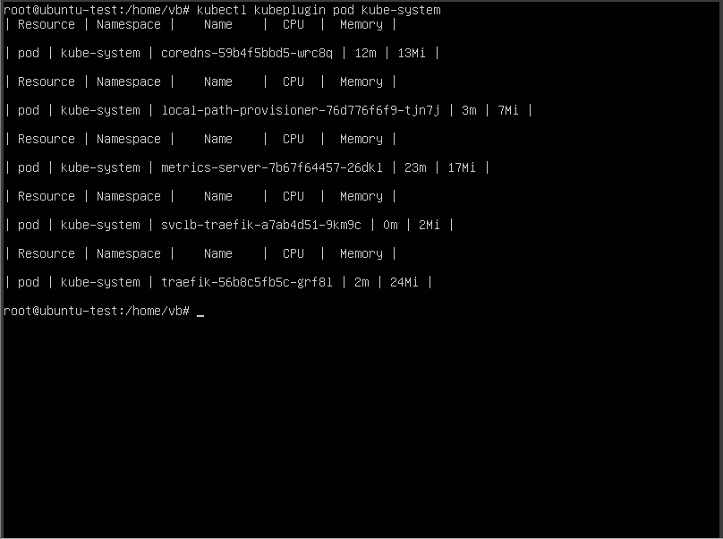
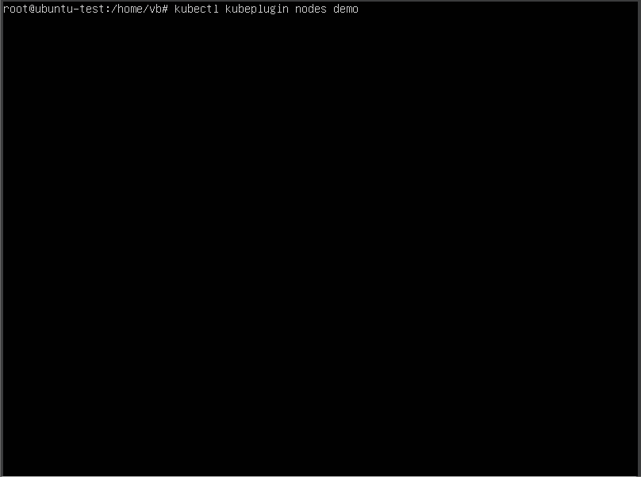

# This is HOWTO for kubernets plugin

This plugin allows to view statistic on resource usage.

The general guidence is described in [this article](https://kubernetes.io/docs/tasks/extend-kubectl/kubectl-plugins/).

To install it copy script on host and run:
```
sudo chmod +x ./kubeplugin
sudo mv ./kubeplugin  /usr/local/bin/kubectl-kubeplugin 
```
Check the plugin is available:
```
kubectl plugin list 
```
To use the script: 
```
kubectl kubeplugin [resource] [namespace]
#### resource can be pod or node
#### Example 
kubectl kubeplugin nodes demo
```


